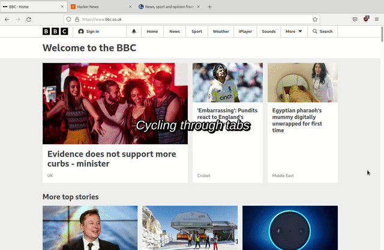

# Mouse Pager web extension

A simple web extension offering some convenient features for page navigation
with mouse scroll wheel. Features can be individually toggled.

* Scroll by page;
* Jump to page top or bottom;
* Cycle through tabs;
* Horizontal scroll;
* Close current tab;

Works for [Firefox](https://addons.mozilla.org/en-US/firefox/addon/mousepager/) and Chrome.

See the screen shot below for the extension in action. Note that the mouse
pointer doesn't need to be moved at all!



## Instructions for local build

```sh
npm install
make
```

Load extension from the directory `mouse-pager-VV`.

To build the `zip` file:

```sh
make zip
```

<!-- vim: set tw=80 spell: -->
